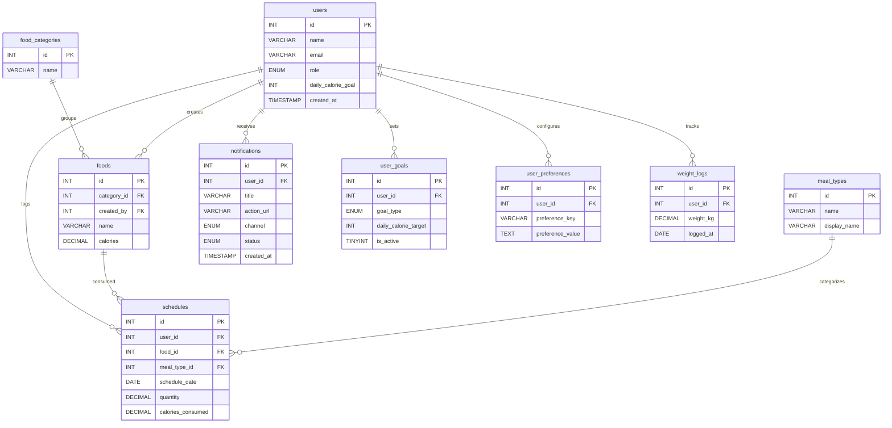

# ERD (Entity Relationship Diagram)

Berikut ERD ringkas berdasarkan [query.sql](query.sql).

Catatan:
- `notifications.channel` dipakai untuk membedakan `in_app` vs `email` log.
- Beberapa entitas memiliki kolom tambahan (lihat detail lengkap di [query.sql](query.sql)).
