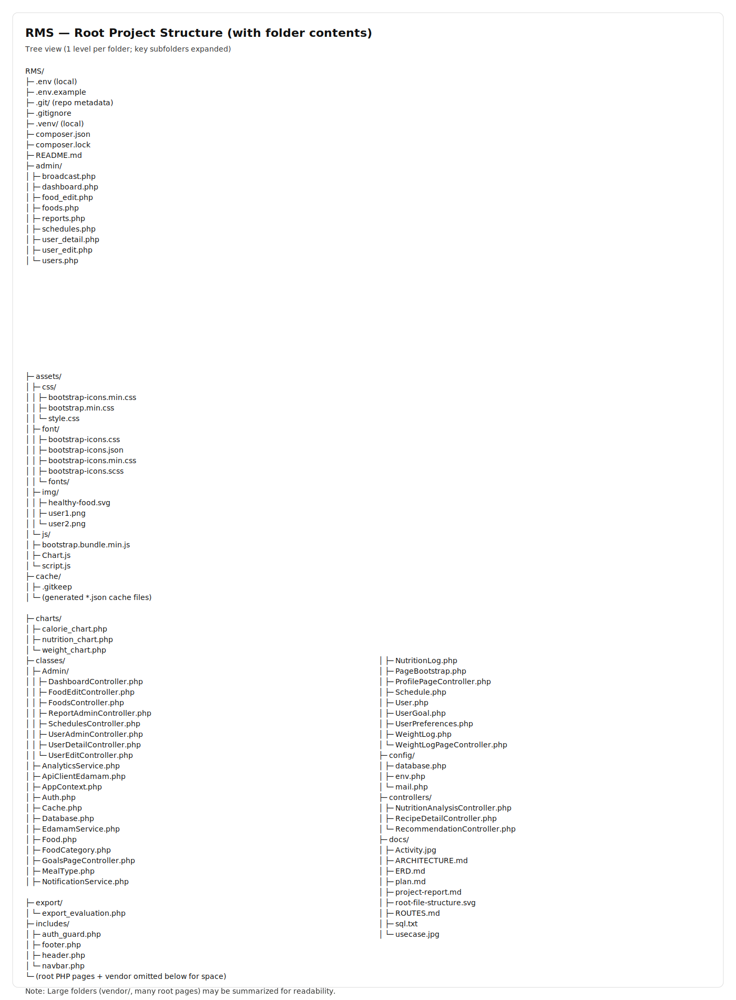

# BAB IV: IMPLEMENTASI SISTEM

## 4.1. PBO dan Pemrograman Web

### 4.1.1. Struktur Kode Program

Proyek RMS (Rekomendasi Makanan Sehat) dibangun menggunakan **PHP native** dengan pola **OOP (Object-Oriented Programming)** sederhana. Struktur folder utama yang digunakan adalah sebagai berikut:



Struktur root (ASCII):

```text
RMS/
├─ composer.json
├─ README.md
├─ index.php
├─ login.php
├─ register.php
├─ dashboard.php
├─ schedules.php
├─ goals.php
├─ weight_log.php
├─ evaluation.php
├─ recommendation.php
├─ recipe_detail.php
├─ nutrition_analysis.php
├─ notifications.php
├─ docs/
├─ admin/
├─ assets/
├─ cache/
├─ charts/
├─ classes/
├─ config/
├─ controllers/
├─ export/
├─ includes/
├─ notifications/
├─ process/
├─ public/
├─ tools/
└─ vendor/
```

- **Root (halaman berbasis file)**
  - `index.php`, `home.php`, `dashboard.php`, `schedules.php`, `goals.php`, `weight_log.php`, `evaluation.php`, `recommendation.php`, `recipe_detail.php`, `nutrition_analysis.php`, `notifications.php`, dll.
  - Halaman-halaman ini berperan sebagai tampilan (view) sekaligus pemanggil service/controller yang diperlukan.

- **`classes/` (inti OOP: model, service, context aplikasi)**
  - `AppContext.php`: inisialisasi session, konfigurasi env, koneksi PDO, user/role, dan path prefix.
  - `Database.php`: pembentukan koneksi PDO.
  - Model/Service utama: `Auth.php`, `Schedule.php`, `WeightLog.php`, `UserGoal.php`, `AnalyticsService.php`, `NotificationService.php`, `EdamamService.php`, dll.

- **`controllers/` (controller ringan untuk fitur berbasis API eksternal)**
  - `RecommendationController.php`: logika rekomendasi resep (Edamam).
  - `NutritionAnalysisController.php`: analisis nutrisi (Edamam Nutrition Analysis).

- **`process/` (endpoint aksi/POST)**
  - Contoh: `login.process.php`, `register.process.php`, `schedule.process.php`, `goal.process.php`, `weight.process.php`, `broadcast.process.php`.
  - Folder ini memproses input POST, memanggil class terkait, lalu melakukan redirect.

- **`admin/` (halaman khusus admin)**
  - `admin/users.php`, `admin/foods.php`, `admin/reports.php`, `admin/broadcast.php`, dll.

- **`notifications/` (cron/CLI + API notifikasi)**
  - `schedule_notifications.php`: scheduler yang dijalankan via cron.
  - `send_daily.php`, `send_daily_menu.php`, `send_goal_evaluation.php`, `send_reminder_log.php`: pengirim notifikasi.
  - `api.php`: API untuk notifikasi in-app.

- **`charts/` (JSON untuk Chart.js)**
  - `calorie_chart.php`, `nutrition_chart.php`, `weight_chart.php`.

- **`config/`**
  - `env.php`: memuat `.env` (Dotenv) dan menghasilkan array konfigurasi.
  - `database.php`, `mail.php`: konfigurasi tambahan.

- **`includes/` (komponen layout)**
  - `header.php`, `navbar.php`, `footer.php`, `auth_guard.php`.

- **`public/`**
  - Untuk deployment dengan docroot terpisah (front controller + static asset proxy).

- **`assets/`**
  - CSS/JS/font/gambar.

- **`tools/`**
  - Script utilitas untuk cek/sinkron skema DB (mis. `schema_compare.php`, `schema_sync.php`).

- **`vendor/`**
  - Dependensi Composer (mis. PHPMailer, Dotenv).


### 4.1.2. Implementasi Fitur Utama

Berikut ringkasan implementasi fitur utama beserta contoh potongan kode penting.

#### A) Autentikasi (Login & Register)

- File terkait:
  - `classes/Auth.php`
  - `process/login.process.php`
  - `process/register.process.php`

Contoh implementasi login menggunakan PDO prepared statement dan verifikasi password hash:

```php
// classes/Auth.php
public function login($identifier, $password) {
  // Accept email or name
  $stmt = $this->db->prepare("SELECT * FROM users WHERE email=? OR name=?");
  $stmt->execute([$identifier, $identifier]);
  $user = $stmt->fetch();

  if ($user && password_verify($password, $user['password'])) {
    $_SESSION['user'] = $user;
    return true;
  }
  return false;
}
```

Pada `process/login.process.php`, setelah sukses login sistem mengarahkan user berdasarkan role:

```php
if ($success) {
  if ($_SESSION['user']['role'] === 'admin') {
    header('Location: ../admin/dashboard.php');
  } else {
    header('Location: ../dashboard.php');
  }
}
```

#### B) Pencatatan Jadwal Makan (Schedules)

- File terkait:
  - `classes/Schedule.php`
  - `process/schedule.process.php`
  - `schedules.php`

Contoh query insert jadwal makan (log menu) pada model `Schedule`:

```php
// classes/Schedule.php
public function create($user, $food, $date, $mealTypeId = null, $quantity = 1, $notes = null) {
  $stmt = $this->db->prepare(
    "INSERT INTO schedules(user_id, food_id, meal_type_id, schedule_date, quantity, notes)
     VALUES (?, ?, ?, ?, ?, ?)"
  );
  return $stmt->execute([$user, $food, $mealTypeId, $date, $quantity, $notes]);
}
```

Contoh query pengambilan jadwal pada tanggal tertentu (join ke tabel `foods` dan `meal_types`):

```php
public function getByDate($user, $date) {
  $stmt = $this->db->prepare(
    "SELECT s.*, f.name as food_name, f.calories, f.image_url, mt.display_name as meal_type_name
     FROM schedules s
     JOIN foods f ON s.food_id = f.id
     LEFT JOIN meal_types mt ON s.meal_type_id = mt.id
     WHERE s.user_id = ? AND s.schedule_date = ?
     ORDER BY mt.sort_order, s.created_at"
  );
  $stmt->execute([$user, $date]);
  return $stmt->fetchAll(PDO::FETCH_ASSOC);
}
```

#### C) Analitik (Chart.js)

- File terkait:
  - `charts/calorie_chart.php`, `charts/nutrition_chart.php`
  - `classes/AnalyticsService.php`

Contoh endpoint JSON untuk chart kalori harian:

```php
// charts/calorie_chart.php
$analytics = new AnalyticsService($app->db());
$data = $analytics->caloriePerDay((int)$app->user()['id']);

echo json_encode([
  'labels' => array_column($data, 'schedule_date'),
  'datasets' => [[
    'label' => 'Kalori Harian',
    'data' => array_column($data, 'total'),
  ]],
]);
```

#### D) Rekomendasi Resep & Analisis Nutrisi (Integrasi Edamam API)

- File terkait:
  - `controllers/RecommendationController.php`
  - `controllers/NutritionAnalysisController.php`
  - `classes/EdamamService.php`

Contoh pemanggilan Edamam Recipe Search (dengan caching 1 jam):

```php
// classes/EdamamService.php
public function searchRecipes(string $query, int $calories = 600, array $options = []): array
{
  $cacheKey = 'edamam_search_' . md5($query . $calories . json_encode($options));
  $cached = $this->cache->get($cacheKey, 3600);
  if ($cached) return $cached;

  $params = [
    'type' => 'public',
    'q' => $query,
    'app_id' => $this->appId,
    'app_key' => $this->appKey,
    'calories' => "0-$calories",
    'imageSize' => 'REGULAR',
    'size' => 6
  ];

  $url = 'https://api.edamam.com/api/recipes/v2?' . http_build_query($params);
  $data = $this->request($url);
  if (isset($data['hits'])) $this->cache->set($cacheKey, $data);
  return $data;
}
```

Pada sisi controller, query pencarian diperluas agar kata kunci Indonesia lebih mudah ditemukan di Edamam (append sinonim Inggris):

```php
// controllers/RecommendationController.php
$query = $this->expandEdamamQuery($search);
$data = $this->edamam->searchRecipes($query, $calories, $options);
```

#### E) Notifikasi (In-App & Email) + Scheduler (Cron/CLI)

- File terkait:
  - `classes/NotificationService.php`
  - `notifications/schedule_notifications.php`

Contoh logging notifikasi email ke tabel `notifications`:

```php
// classes/NotificationService.php
$stmt = $this->db->prepare(
  "INSERT INTO notifications (user_id, title, message, action_url, type, channel, status, created_at)
   VALUES (?, ?, ?, ?, 'info', 'email', ?, NOW())"
);
$stmt->execute([$userId, $title, $message, $actionUrl, $status]);
```

Scheduler menyimpan status eksekusi dan mendukung UPSERT berdasarkan `schedule_type`:

```php
// notifications/schedule_notifications.php
$stmt = $db->prepare(
  "INSERT INTO notification_schedules (schedule_type, last_run, status, message)
   VALUES (?, ?, ?, ?)
   ON DUPLICATE KEY UPDATE last_run = ?, status = ?, message = ?"
);
```


### 4.1.3. Integrasi dengan Basis Data

Aplikasi berkomunikasi dengan database **MySQL/MariaDB** menggunakan **PDO**.

1) **Inisialisasi koneksi**
- `config/env.php` membaca variabel `.env`.
- `classes/Database.php` membuat koneksi PDO:

```php
$this->conn = new PDO(
  "mysql:host={$config['DB_HOST']};dbname={$config['DB_NAME']}",
  $config['DB_USER'],
  $config['DB_PASS']
);
$this->conn->setAttribute(PDO::ATTR_ERRMODE, PDO::ERRMODE_EXCEPTION);
```

2) **Akses database secara konsisten**
- `classes/AppContext.php` menjadi “single entry point” untuk mendapatkan PDO:

```php
$app = AppContext::fromRootDir(__DIR__ . '/..');
$db = $app->db();
```

3) **Keamanan query**
- Hampir seluruh query menggunakan prepared statement untuk menghindari SQL Injection.
- Data user tersimpan di `$_SESSION['user']` setelah login.


## 4.2. Database

### 4.2.1. Struktur Tabel

Skema database didefinisikan pada file `docs/query.sql`. Database utama bernama `db_rms`.

Berikut tabel-tabel inti yang digunakan (kolom dan tipe data mengikuti `docs/query.sql`).

#### Tabel: `users`
| Kolom | Tipe Data |
|---|---|
| id | INT (AI, PK) |
| name | VARCHAR(100) |
| email | VARCHAR(150) (UNIQUE) |
| password | VARCHAR(255) |
| role | ENUM('admin','user') |
| avatar | VARCHAR(255) |
| phone | VARCHAR(20) |
| date_of_birth | DATE |
| gender | ENUM('male','female','other') |
| height_cm | DECIMAL(5,2) |
| weight_kg | DECIMAL(5,2) |
| activity_level | ENUM('sedentary','light','moderate','active','very_active') |
| daily_calorie_goal | INT |
| created_at | TIMESTAMP |
| updated_at | TIMESTAMP |
| last_login | TIMESTAMP NULL |
| is_active | TINYINT(1) |

#### Tabel: `food_categories`
| Kolom | Tipe Data |
|---|---|
| id | INT (AI, PK) |
| name | VARCHAR(50) (UNIQUE) |
| description | TEXT |
| icon | VARCHAR(50) |
| created_at | TIMESTAMP |

#### Tabel: `foods`
| Kolom | Tipe Data |
|---|---|
| id | INT (AI, PK) |
| category_id | INT (FK -> food_categories.id) |
| name | VARCHAR(150) |
| description | TEXT |
| calories | DECIMAL(8,2) |
| protein | DECIMAL(6,2) |
| fat | DECIMAL(6,2) |
| carbs | DECIMAL(6,2) |
| fiber | DECIMAL(6,2) |
| sugar | DECIMAL(6,2) |
| sodium | DECIMAL(6,2) |
| image_url | VARCHAR(1024) |
| is_verified | TINYINT(1) |
| created_by | INT (FK -> users.id) |
| created_at | TIMESTAMP |
| updated_at | TIMESTAMP |

#### Tabel: `meal_types`
| Kolom | Tipe Data |
|---|---|
| id | INT (AI, PK) |
| name | VARCHAR(50) (UNIQUE) |
| display_name | VARCHAR(50) |
| icon | VARCHAR(50) |
| sort_order | INT |
| is_active | TINYINT(1) |

#### Tabel: `schedules`
| Kolom | Tipe Data |
|---|---|
| id | INT (AI, PK) |
| user_id | INT (FK -> users.id) |
| food_id | INT (FK -> foods.id) |
| meal_type_id | INT (FK -> meal_types.id) |
| schedule_date | DATE |
| quantity | DECIMAL(6,2) |
| notes | TEXT |
| calories_consumed | DECIMAL(8,2) |
| created_at | TIMESTAMP |
| updated_at | TIMESTAMP |

#### Tabel: `notifications`
| Kolom | Tipe Data |
|---|---|
| id | INT (AI, PK) |
| user_id | INT (FK -> users.id) |
| title | VARCHAR(150) |
| message | TEXT |
| action_url | VARCHAR(512) NULL |
| type | VARCHAR(20) |
| channel | ENUM('email','push','in_app') |
| status | ENUM('unread','read','sent','failed') |
| scheduled_at | TIMESTAMP NULL |
| sent_at | TIMESTAMP NULL |
| created_at | TIMESTAMP |

#### Tabel: `notification_schedules`
| Kolom | Tipe Data |
|---|---|
| id | INT (AI, PK) |
| schedule_type | VARCHAR(20) (UNIQUE) |
| last_run | DATETIME NULL |
| status | ENUM('success','failed') |
| message | TEXT |
| created_at | TIMESTAMP |
| updated_at | TIMESTAMP |

#### Tabel: `user_goals`
| Kolom | Tipe Data |
|---|---|
| id | INT (AI, PK) |
| user_id | INT (FK -> users.id) |
| goal_type | ENUM('weight_loss','weight_gain','maintain','muscle_gain') |
| target_weight_kg | DECIMAL(5,2) |
| target_date | DATE |
| weekly_weight_change | DECIMAL(3,2) |
| daily_calorie_target | INT |
| daily_protein_target | DECIMAL(6,2) |
| daily_fat_target | DECIMAL(6,2) |
| daily_carbs_target | DECIMAL(6,2) |
| evaluation | TEXT |
| status | VARCHAR(20) |
| last_notif | TIMESTAMP NULL |
| progress | DECIMAL(5,2) |
| is_active | TINYINT(1) |
| created_at | TIMESTAMP |
| updated_at | TIMESTAMP |

#### Tabel: `user_preferences`
| Kolom | Tipe Data |
|---|---|
| id | INT (AI, PK) |
| user_id | INT (FK -> users.id) |
| preference_key | VARCHAR(50) |
| preference_value | TEXT |
| created_at | TIMESTAMP |
| updated_at | TIMESTAMP |

#### Tabel: `weight_logs`
| Kolom | Tipe Data |
|---|---|
| id | INT (AI, PK) |
| user_id | INT (FK -> users.id) |
| weight_kg | DECIMAL(5,2) |
| body_fat_percentage | DECIMAL(4,2) |
| muscle_mass_kg | DECIMAL(5,2) |
| notes | TEXT |
| logged_at | DATE |
| created_at | TIMESTAMP |


### 4.2.2. Query-Query Penting

Berikut contoh query utama yang digunakan aplikasi (diambil dari file PHP dan skema `docs/query.sql`).

1) **Login**
```sql
SELECT * FROM users WHERE email = ? OR name = ?;
```

2) **Register User**
```sql
INSERT INTO users(name, email, password) VALUES (?, ?, ?);
```

3) **Tambah Jadwal Makan**
```sql
INSERT INTO schedules(user_id, food_id, meal_type_id, schedule_date, quantity, notes)
VALUES (?, ?, ?, ?, ?, ?);
```

4) **Ambil Jadwal Makan Harian (Join foods + meal_types)**
```sql
SELECT s.*, f.name AS food_name, f.calories, f.image_url, mt.display_name AS meal_type_name
FROM schedules s
JOIN foods f ON s.food_id = f.id
LEFT JOIN meal_types mt ON s.meal_type_id = mt.id
WHERE s.user_id = ? AND s.schedule_date = ?
ORDER BY mt.sort_order, s.created_at;
```

5) **Notifikasi (Log Email / Create In-App)**
```sql
INSERT INTO notifications (user_id, title, message, action_url, type, channel, status, created_at)
VALUES (?, ?, ?, ?, 'info', 'email', ?, NOW());

INSERT INTO notifications (user_id, title, message, action_url, type, channel, status, created_at)
VALUES (?, ?, ?, ?, ?, 'in_app', 'unread', NOW());
```

6) **Scheduler Log (UPSERT)**
```sql
INSERT INTO notification_schedules (schedule_type, last_run, status, message)
VALUES (?, ?, ?, ?)
ON DUPLICATE KEY UPDATE
  last_run = ?, status = ?, message = ?;
```

7) **View untuk ringkasan nutrisi harian**
```sql
CREATE VIEW daily_nutrition_summary AS
SELECT s.user_id, s.schedule_date,
       SUM(s.calories_consumed) AS total_calories,
       SUM(f.protein * s.quantity) AS total_protein,
       SUM(f.fat * s.quantity) AS total_fat,
       SUM(f.carbs * s.quantity) AS total_carbs,
       SUM(f.fiber * s.quantity) AS total_fiber,
       COUNT(s.id) AS total_meals
FROM schedules s
JOIN foods f ON s.food_id = f.id
GROUP BY s.user_id, s.schedule_date;
```

8) **Trigger perhitungan kalori otomatis**
```sql
CREATE TRIGGER calculate_calories_on_insert
BEFORE INSERT ON schedules
FOR EACH ROW
BEGIN
  SET NEW.calories_consumed =
    (SELECT calories FROM foods WHERE id = NEW.food_id) * NEW.quantity;
END;
```

9) **Upsert log berat badan (1 user per hari)**
```sql
INSERT INTO weight_logs (user_id, weight_kg, body_fat_percentage, muscle_mass_kg, notes, logged_at)
VALUES (?, ?, ?, ?, ?, ?)
ON DUPLICATE KEY UPDATE
  weight_kg = VALUES(weight_kg),
  body_fat_percentage = VALUES(body_fat_percentage),
  muscle_mass_kg = VALUES(muscle_mass_kg),
  notes = VALUES(notes);
```


---

Catatan: Dokumen ini fokus pada implementasi BAB IV. Untuk detail ERD dan alur sistem, lihat `docs/ERD.md` dan `docs/ARCHITECTURE.md`.


# BAB V: PENGUJIAN SISTEM

## 5.1. Metode Pengujian

Pengujian pada sistem RMS dilakukan untuk memastikan setiap fitur berjalan sesuai kebutuhan fungsional, integrasi antarkomponen konsisten, serta tampilan antarmuka dapat digunakan dengan baik. Metode yang digunakan mencakup:

### 5.1.1. Pengujian Unit (Unit Testing)

Pengujian unit difokuskan pada fungsi/kelas inti di folder `classes/` dan sebagian controller ringan. Karena aplikasi dibangun dengan PHP native tanpa framework testing khusus, pengujian unit dilakukan dengan pendekatan:

- **White-box test sederhana**: memanggil method tertentu secara terisolasi menggunakan input valid/invalid, lalu memverifikasi output/efeknya (mis. return value, data yang dihasilkan).
- **Database-backed unit check**: untuk method yang membutuhkan PDO, digunakan database pengujian (atau database yang sama dengan data dummy) dan divalidasi menggunakan query SELECT setelah operasi INSERT/UPDATE.

Contoh unit yang diuji:
- `Auth::login()` memverifikasi login benar/salah.
- `Schedule::create()` memastikan insert jadwal berhasil.
- `WeightLog`/`UserGoal` memastikan perhitungan/proses penyimpanan berjalan.
- `Cache` memastikan cache-set/get bekerja.

### 5.1.2. Pengujian Integrasi (Integration Testing)

Pengujian integrasi memverifikasi alur end-to-end antar modul berikut:

- **Halaman (root view)** → **process/** (POST handler) → **classes/** (model/service) → **database** → redirect.
- Integrasi **API eksternal Edamam** melalui `controllers/RecommendationController.php`, `controllers/NutritionAnalysisController.php`, dan `classes/EdamamService.php`.
- Integrasi **notifikasi** (in-app/email) melalui `classes/NotificationService.php` dan scheduler di folder `notifications/`.

Fokus integrasi mencakup:
- Validasi input (wajib/format)
- Konsistensi sesi login (`$_SESSION['user']`)
- Konsistensi data pada DB setelah aksi (create/update/delete)
- Penanganan error (API eksternal gagal, data kosong, dan akses tanpa login)

### 5.1.3. Pengujian Antarmuka (UI/Usability Testing)

Pengujian antarmuka dilakukan dengan pendekatan **black-box** pada browser:

- Memastikan setiap halaman utama dapat diakses sesuai role (admin vs user).
- Memastikan form memiliki validasi dasar (wajib diisi, batasan angka) dan menampilkan pesan yang mudah dipahami.
- Memastikan komponen penting tampil konsisten: navbar, tabel, kartu rekomendasi, grafik (Chart.js).

Pengujian UI dilakukan pada:
- Halaman `login.php`, `register.php`
- Dashboard dan halaman fitur user (`schedules.php`, `goals.php`, `weight_log.php`, `recommendation.php`, `nutrition_analysis.php`, `notifications.php`)
- Halaman admin (`admin/dashboard.php`, `admin/users.php`, `admin/foods.php`, `admin/reports.php`)

### 5.1.4. Lingkungan dan Data Uji

- **Web server**: Localhost.
- **Database**: MySQL
- **Data uji**: akun user dan admin, data makanan (foods), meal types, jadwal makan beberapa hari, log berat badan, serta konfigurasi `.env` untuk Edamam dan email.


## 5.2. Hasil Pengujian

Hasil pengujian dirangkum dalam tabel berikut. Bukti dapat dilampirkan berupa screenshot tiap halaman/aksi (mis. setelah submit form sukses, tampilan grafik, dan halaman notifikasi).

### 5.2.1. Tabel Hasil Pengujian Fungsional

| ID | Skenario Uji | Langkah Uji (Ringkas) | Data Uji | Hasil yang Diharapkan | Hasil Aktual | Status |
|---:|---|---|---|---|---|:---:|
| TC-01 | Login user berhasil | Isi email/username + password valid → Login | user@email.com / password benar | Masuk ke `dashboard.php` dan session terbentuk | Sesuai | Lulus |
| TC-02 | Login gagal | Isi password salah → Login | password salah | Tampil pesan gagal dan tidak membuat session | Sesuai | Lulus |
| TC-03 | Register user | Isi form register → Submit | email unik | Akun tersimpan (hash password) dan bisa login | Sesuai | Lulus |
| TC-04 | Guard halaman tanpa login | Akses `dashboard.php` tanpa session | - | Redirect ke login / blok akses | Sesuai | Lulus |
| TC-05 | Buat jadwal makan | Pilih makanan + tanggal + meal type → Simpan | qty 1–2 | Data `schedules` bertambah dan tampil di list | Sesuai | Lulus |
| TC-06 | Lihat jadwal harian | Pilih tanggal → tampil daftar | tanggal dengan data | Menampilkan foods + meal type + urutan benar | Sesuai | Lulus |
| TC-07 | Hitung kalori konsumsi | Tambah schedule dengan qty | qty 2 | Kolom `calories_consumed` terhitung sesuai | Sesuai | Lulus |
| TC-08 | Input log berat badan | Isi berat + tanggal → Simpan | 65.5 kg | Data `weight_logs` tersimpan/ter-update (1/hari) | Sesuai | Lulus |
| TC-09 | Grafik berat badan | Buka halaman chart | data log beberapa hari | Grafik muncul dan label tanggal benar | Sesuai | Lulus |
| TC-10 | Set goals | Isi target berat/tanggal → Simpan | target valid | Data `user_goals` tersimpan dan status aktif | Sesuai | Lulus |
| TC-11 | Evaluasi goals | Jalankan evaluasi dari halaman | jadwal+weight ada | Muncul ringkasan dan/atau notifikasi evaluasi | Sesuai | Lulus |
| TC-12 | Rekomendasi resep (Edamam) | Isi kata kunci → Cari | “ayam”/“chicken” | Daftar resep tampil (cache bekerja) | Sesuai* | Lulus |
| TC-13 | Analisis nutrisi (Edamam) | Input bahan/menu → Analisis | “1 egg” | Nutrisi tampil (kalori, makro) | Sesuai* | Lulus |
| TC-14 | Notifikasi in-app tampil | Buka `notifications.php` | ada notifikasi | List notifikasi tampil dan bisa ditandai read | Sesuai | Lulus |
| TC-15 | Admin kelola user | Login admin → buka users → edit | user aktif/nonaktif | Update user tersimpan dan terlihat pada daftar | Sesuai | Lulus |
| TC-16 | Admin kelola foods | Admin tambah/edit food | data makanan | Data foods tersimpan dan dipakai schedule | Sesuai | Lulus |
| TC-17 | Endpoint chart JSON | Akses `charts/*.php` via browser | - | Response JSON valid untuk Chart.js | Sesuai | Lulus |
| TC-18 | Uji injeksi SQL sederhana | Isi login dengan payload | `'n'test` | Tidak error SQL; login tetap gagal aman | Sesuai | Lulus |

Keterangan:
- Tanda **Sesuai\*** pada Edamam bergantung pada ketersediaan internet serta validitas `APP_ID/APP_KEY` pada `.env`.

### 5.2.2. Daftar Bukti (Screenshot) yang Disarankan

Untuk memenuhi kebutuhan lampiran bukti, berikut daftar screenshot yang dapat diambil:

1) Halaman login (gagal & berhasil)
2) Dashboard setelah login
3) Halaman schedules (sebelum dan sesudah tambah jadwal)
4) Halaman weight log (input + grafik)
5) Halaman goals dan evaluation
6) Halaman recommendation dan recipe detail
7) Halaman nutrition analysis
8) Halaman notifications (unread → read)
9) Halaman admin: users, foods, reports


## 5.3. Evaluasi Sistem

Berdasarkan hasil pengujian, evaluasi sistem RMS dapat dirangkum sebagai berikut.

### 5.3.1. Kekuatan (Strengths)

- **Struktur modular dan mudah dipahami**: pemisahan `classes/`, `controllers/`, dan `process/` membantu alur kerja jelas.
- **Keamanan query cukup baik**: mayoritas query menggunakan prepared statement (mengurangi risiko SQL Injection).
- **Fitur inti berjalan stabil**: autentikasi, pencatatan jadwal makan, log berat badan, goals, dan notifikasi berhasil sesuai kebutuhan.
- **Integrasi API eksternal + caching**: integrasi Edamam dan caching mengurangi beban request dan mempercepat respons pada pencarian yang sama.
- **Visualisasi data membantu user**: penggunaan Chart.js memudahkan pemantauan kalori dan berat badan.

### 5.3.2. Kelemahan (Weaknesses)

- **Belum ada automation testing formal**: pengujian unit/integrasi masih dominan manual sehingga regresi berpotensi terjadi saat perubahan fitur.
- **Ketergantungan pada layanan eksternal**: fitur Edamam bergantung pada jaringan dan kredensial API; jika down/limit, hasil rekomendasi dan analisis nutrisi terpengaruh.
- **Validasi input masih dapat ditingkatkan**: beberapa form sebaiknya memiliki validasi server-side yang lebih ketat (range angka, format, sanitasi) dan pesan error lebih spesifik.
- **Observability terbatas**: logging error dan tracing eksekusi (mis. scheduler notifikasi) masih minimal, sehingga debugging di production bisa lebih sulit.

### 5.3.3. Rekomendasi Perbaikan

- Menambahkan **framework testing** (mis. PHPUnit) untuk unit test pada `classes/` dan uji integrasi sederhana untuk `process/`.
- Menambahkan **fallback/handling** ketika API Edamam gagal (pesan user-friendly + retry/backoff + logging).
- Memperkuat **validasi server-side** dan konsistensi sanitasi input.
- Menambahkan **logging terstruktur** untuk error dan aktivitas penting (login, create schedule, scheduler run).
